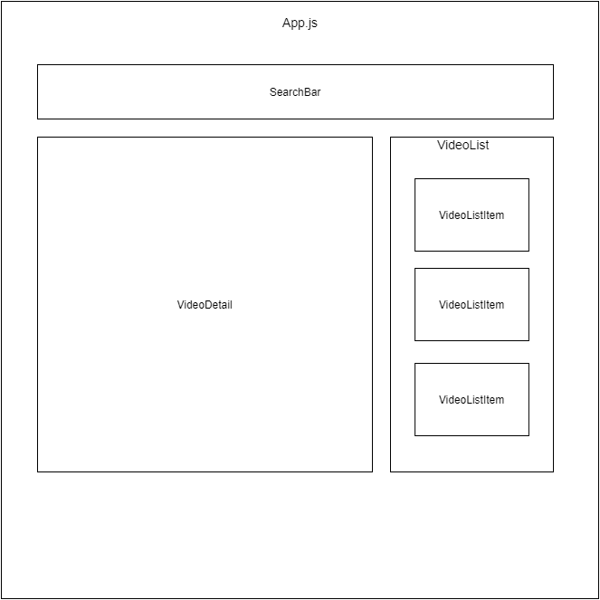

# React Tube

## Requirements

1. npm from node or nvm.
2. Google account to create and enable YouTube API Data V3: https://blog.hubspot.com/website/how-to-get-youtube-api-key
3. YouTube API search docs: https://developers.google.com/youtube/v3/docs/search
4. axios: https://www.npmjs.com/package/axios

I suggest using nvm for node version manager

See their repo for windows installation

https://github.com/coreybutler/nvm-windows

---

A simple React app using create-react-app.

See https://reactjs.org/docs/create-a-new-react-app.html on how to scaffold a react app.

---

This project is design to help developers understand communication between React component in a straight forward way. No routing, no state, just basic workflow.

1 parent component which is the App.js and two three child components (SearchBar, VideoList, and VideoDetail), and one sub child component VideoListItem that would be used inside VideoList component.

See Projects tab for kanban guideline https://github.com/mikebernal/react-tube/projects/1

Good luck! :)

Please don't hesitate to contact me for help.

May the force be with you.
